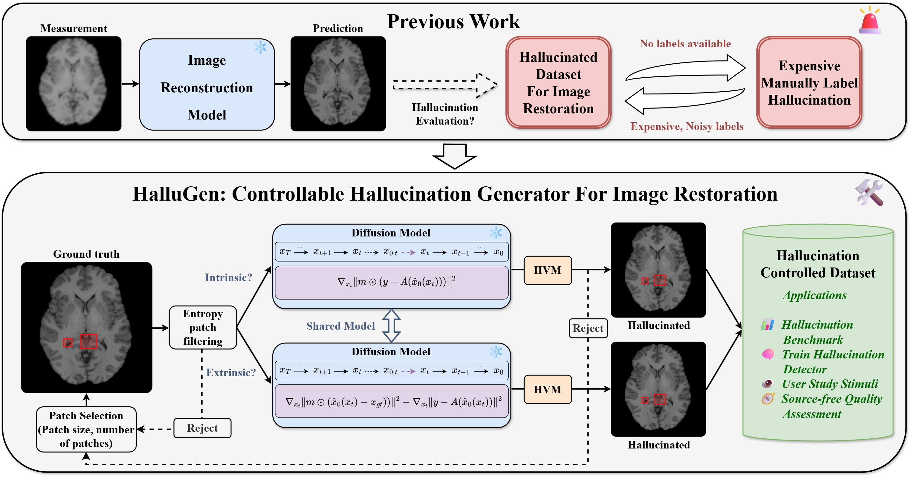
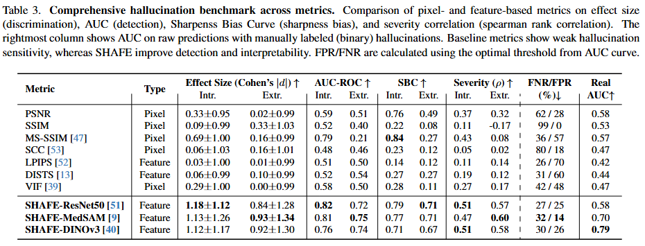
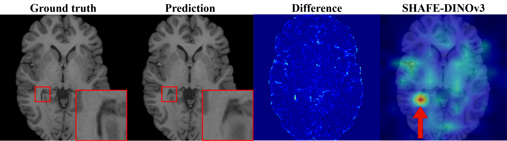

# HalluGen: Synthesizing Realistic and Controllable Hallucinations for Evaluating Image Restoration

**Official repository for HalluGen (Accepted to CVPR 2026)**

> **Status:** Code under active development

---

## Overview


*Schematic diagram of the HalluGen framework — a controllable, diffusion-based hallucination generator.*

---

## Results

### Generated Hallucinations

*HalluGen-generated samples for intrinsic and extrinsic hallucinations on brain MRI and inspection images.*

### SHAFE Evaluation

*SHAFE outperforms all other image quality metrics on the HalluGen benchmark.*

### Hallucination Localization

*SHAFE localises hallucinations from real restoration outputs.*

---

## Repository Structure

```
HalluGen/
├── image_sample_hallugen.py   # Diffusion-based hallucination dataset generation
├── hallubench_new.py          # SHAFE metric and HalluBench evaluation suite
├── configs.yaml               # Generation and model configuration
├── guided_diffusion/
│   ├── condition_methods.py   # Posterior-sampling conditioning (HVM, intrinsic/extrinsic)
│   ├── gaussian_diffusion.py  # Core diffusion process
│   ├── measurements.py        # Forward measurement operators
│   └── ...
└── util/
    └── ...
```

---

## Installation

```bash
pip install -r requirements.txt
```

**External dependency:** [SAM-Med2D](https://github.com/uni-medical/SAM-Med2D) must be cloned and its
path added to `PYTHONPATH` (or the `sys.path.append` lines in `condition_methods.py` and
`hallubench_new.py` updated to its local location). Download the `sam-med2d_b.pth` checkpoint and
update `sam_checkpoint` in `configs.yaml` accordingly.

---

## Usage

### Generating a Hallucination Dataset with HalluGen

Configure paths and flags in `configs.yaml`, then run:

```bash
python image_sample_hallugen.py \
    --model_path /path/to/model.pt \
    --save_path  /path/to/output/dir \
    --data_dir   /path/to/synth_gt \
    --nohallu_dir /path/to/dps_nohallu \
    --results_dir /path/to/results
```

All path arguments have defaults that match the original cluster layout; override them on the
command line for your environment.

To train a diffusion model from scratch first:

```bash
python image_train.py
```

#### Key `configs.yaml` options

| Key | Description |
|-----|-------------|
| `norm` | Normalisation mode (`zero2two` \| `zscore` \| `minmax`) |
| `extrinsic` | `True` → extrinsic hallucination; `False` → intrinsic |
| `interpolate_nohallu` | Initialise diffusion from a clean (no-hallucination) prediction |
| `perturb_measurement` | Add noise to the measurement in the hallucinated region |
| `skip_timestep` | Number of diffusion steps to skip (warm-start from a noisy image) |
| `semantic` | Enable semantic (feature-level) guidance in the hallucination region |
| `conditioning.params.scale` | Posterior-sampling step size |

### Using the SHAFE Hallucination Metric

SHAFE can be used as a standalone API. Import and instantiate directly from `hallubench_new.py`:

```python
from hallubench_new import SpatialFeatureMetric, patchwise_metric

metric = SpatialFeatureMetric(distance='cosine', use_patches=False)
score = patchwise_metric(gt, pred, metric_fn=metric, use_patches=False,
                         agg='softmax', temperature=0.005)
# gt, pred: torch.Tensor of shape (B, 3, H, W), values in [0, 1]
```

#### Running the full HalluBench evaluation suite

```bash
python hallubench_new.py
```

This runs:
- **Effect-size analysis** — Cohen's d between hallucinated and clean predictions
- **AUC scoring** — ROC-AUC for intrinsic vs. extrinsic hallucination detection
- **Quality–Correctness Trade-off (SBC-AUC)** — win-rate sweep across frequency bandwidths
- **Severity correlation** — Spearman ρ between SHAFE scores and hallucination severity masks
- **Noise-robustness** — win rates under additive Gaussian noise

---

## Key Components

### `image_sample_hallugen.py`
Generates a synthetic hallucination dataset by running the pre-trained diffusion model under two
regimes:
- **Intrinsic hallucination** — the model is guided away from the true measurement in a randomly
  selected high-entropy patch, producing plausible but measurement-inconsistent content.
- **Extrinsic hallucination** — a semantically different reference image is used to inject
  structure into the patch while keeping the measurement consistent.

Patch selection enforces a minimum entropy threshold and a buffer gap between patches.
A **Hallucination Verification Module (HVM)** checks each generated sample with Cohen's d before
it is saved.

### `hallubench_new.py` (SHAFE + HalluBench)
- **`SpatialFeatureMetric`** — computes cosine / Euclidean / MMD / Mahalanobis distance between
  SAM-Med2D spatial feature maps, supporting both whole-image and patch modes.
- **`patchwise_metric`** — aggregates spatial distance maps with `mean | max | worstk | softmax`
  strategies.
- **`apply_lowpass_filter`** — FFT-based circular or rectangular low-pass filter used to suppress
  high-frequency noise before scoring.
- Evaluation functions: `evaluate_metrics`, `auc_score_test`, `quality_correctness_tradeoff`,
  `severity_correlation`, `z_score_sensitivity`.

### `guided_diffusion/condition_methods.py`
Implements the posterior-sampling conditioning step used during generation:
- **`PosteriorSampling` (`ps`)** — the main conditioning method used by HalluGen. Maintains
  separate gradients for the hallucination mask region and the background:
  - *Intrinsic*: background guided toward the measurement; hallucination region pushed away.
  - *Extrinsic*: background guided toward the measurement; hallucination region guided toward
    a reference image in feature space.
- **`hallucination_verification`** — per-box Cohen's d check that each patch satisfies the
  hallucination criteria before the sample is accepted.
- Feature extractors: `SAMMed2DFeatExtractor`, `SAMFeatExtractor`, `TimmFeatExtractor`.

---

## Citation

If you find this work useful, please cite:

```bibtex
@inproceedings{hallugen2026,
  title     = {HalluGen: Synthesizing Realistic and Controllable Hallucinations for Evaluating Image Restoration},
  booktitle = {Proceedings of the IEEE/CVF Conference on Computer Vision and Pattern Recognition (CVPR)},
  year      = {2026},
}
```
